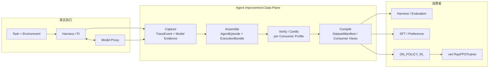

# Agent Improvement Data Plane

> **Harness-neutral、trainer-neutral 的 Agent 可信执行与训练数据基础设施。**
>
> 把一次真实 Agent 执行，变成可验证、可认证、可训练的证据。

<p align="center">
  
  
  
  
</p>

<p align="center">
  <a href="PROJECT_SCOPE.md">项目范围</a> ·
  <a href="PROJECT_PLAN.md">实施计划</a> ·
  <a href="docs/architecture.md">架构说明</a> ·
  <a href="docs/data-contract.md">数据契约</a> ·
  <a href="docs/plans/verl-integration-design.md">verl 接入设计</a> ·
  <a href="docs/plans/verl-closeout/acceptance.md">verl 验收报告</a>
</p>

---

## 30 秒读懂

- **问题**：Agent 的普通日志可能不完整、缺工具 I/O、来自错误 policy、把基础设施故障当成模型失败——格式看起来合法，却不足以支撑 Harness 归因或模型训练。
- **方案**：把真实执行记录成 append-only 事实，组装为确定性 `AgentEpisode`，用内容寻址的 `ExecutionBundle` 绑定 policy trace 与 verifier 证据，再按消费者做 fail-closed 认证，最后编译成 SFT / Preference / Evaluation / ON_POLICY_RL 数据视图。
- **最新里程碑**：数据平面已接入 **verl 官方 trainer**（`verl.trainer.main_ppo` → `RayPPOTrainer.fit()`），在双卡 RTX PRO 6000 上完成两个 GRPO LoRA step（P0 → P1 → P2）；**第二次 rollout 确认消费的是 step 1 同步进推理引擎的新权重**。
- **诚实边界**：链路已验证，但模型能力提升尚未复现。所有负面结果与 Gate 拒绝都保留为证据，不包装成“训练成功”。

## 它解决什么问题

| 常见做法 | 会产生什么错误 | 本项目怎么解决 |
|---|---|---|
| 把 trace / log 直接当训练数据 | 缺字段、缺 verifier、来自错误 policy 的数据静默进入训练 | capability + lineage + consumer certification，**不能证明就拒绝** |
| 只保存最终 trajectory | 长事务中途崩溃后全部证据丢失 | append-only event log，写入即持久化；episode 可由原始事件重建 |
| 用 `success=False` 判断一切 | 基础设施超时被当成 reward 0，污染奖励信号 | `task_status` / `execution_validity` / `integrity` 三轴分离 |
| 把外部 API 返回文本重新 tokenize | behavior logprob 与训练 token 不对齐，RL 语义失真 | 受控服务原生 token / logprob / policy fingerprint 才具备 RL capability |
| 按 trajectory 随机切分数据集 | 同一任务的不同 attempt 泄漏到 train / test | 按 **logical task** 切分，preference group 严格一 CHOSEN 一 REJECTED |
| Patch 训练框架或复制 trainer 代码 | 上游升级即失效，项目维护两套训练循环 | 只使用 verl 官方扩展点，训练循环 / 更新 / 权重同步全部归框架 |

## 项目做到了什么

### 1. 统一的执行证据契约

- **`ExecutionIdentity`**：每次具体 attempt 的唯一身份，贯穿 episode、provider artifact、verifier、certification 和 dataset；避免用 `task_id` 冒充执行身份。
- **`TraceEvent`**：不可变事实单元，建立 event / run / episode / trace / span / attempt 多层身份。
- **`AgentEpisode`**：由事件确定性组装，保留 outcome、termination、integrity 和 source lineage。
- **`ExecutionBundle`**：把同一次 attempt 的 Episode、policy trace、model evidence、verifier 结果、artifact checksum 严格 join；**认证不写回 bundle**，避免循环 checksum 图。
- **`EligibilityDecision` / `EpisodeCertification`**：消费者维度的可追溯认证结论，错误、缺失、损坏均 fail closed。

### 2. 真实执行、采集与可靠性

- **Local Docker Launcher**：默认执行入口，统一分配 identity，并施加只读 root、cap-drop、no-new-privileges、资源限制与显式网络策略。
- **`execute-local` 单事务编排**：prepare → proxy → Harness → verifier → finalize → cleanup，一次拥有完整生命周期。
- **Model Proxy evidence**：OpenAI-compatible HTTP forwarder，逐 execution bearer token；区分可观测文本与原生 token/logprob/policy evidence。
- **Harness event ingress**：任意 Harness 只提交事实描述，identity、sequence、timestamp、event ID 由宿主生成。
- **Append-only storage**：单进程 `fsync` 幂等写入；多进程 `PartitionedEventStore` 提供锁、冲突 quarantine、manifest recovery 和原子 compaction。
- **内容寻址 artifact**：stdout/stderr、workspace patch、verifier report 等大对象按 SHA-256 保存；event 只保留稳定引用。
- **可恢复存储**：partition manifest 可从 append-only 原始事件重建；compaction 使用原子替换，避免半写入状态被静默接受。

### 3. Fail-closed 消费者认证

- 认证 Profile 覆盖：`HARNESS_ANALYSIS`、`EVALUATION`、`SFT`、`PREFERENCE`、`OFF_POLICY_RL`、`ON_POLICY_RL`。
- 任务失败与基础设施失败严格区分：`FAILURE + VALID + COMPLETE` 是有效负样本；`UNKNOWN + INFRA_INVALID` 不会被改写成 reward 0。
- Capability 是**观测权限**：没有 `TOOL_IO` 时工具调用数只能是 `NOT_OBSERVABLE`，不能报 0；没有 token usage 时不从文本反推 canonical token 数。
- ON_POLICY_RL 额外要求 bundle-bound policy artifact、原生 response token IDs、对齐 behavior logprobs 和一致 policy fingerprint。

### 4. 数据集与学习视图

- **`DatasetManifest`**：不可变 membership、purpose、split、role 和 certification lineage。
- **Split leakage Gate**：同一 logical task 的所有 attempt / group 必须落在同一个 split。
- **Preference pairing Gate**：每个 preference group 必须恰好包含一个 `CHOSEN` 和一个 `REJECTED`。
- **Canonical action / SFT views**：将 Harness 私有动作协议规范化为 workspace-relative canonical actions，再导出 generic SFT、模型原生 tool 格式和 Harness improvement metrics。
- 真实数据质量复盘：`[REDACTED]` thinking token、宿主绝对路径泄漏、逐轮分布偏移都被 fail-closed 清洗逻辑拦截并记录。

### 5. 原生 RL 接入：verl 与 Slime

- **verl 官方扩展点，不 patch 安装包**：只替换 `agent_loop_manager_class`、`agent_loop_workers_class`、agent loop `_target_` 和 `server_manager` recipe hook。
- **认证门放在 batch 边界**：`CertifiedVerlAgentLoopManager.generate_sequences` 在 trainer 拿到数据前做批认证；证书不通过不能旁路进入优化器。
  - 零组内方差：重抽一个新 episode，并把拒绝的 attempt 留痕。
  - 证据被篡改 / artifact 不绑定 token / 混任务 / 无 verifier：首次即停。
- **原生 token transport**：不重新 tokenize 模型生成；`response_mask` 精确区分策略 token 与工具观察 / padding，rollout logprob 直接进入训练。
- **Slime admission envelope**：严格重新核验 manifest / decision / bundle / artifact 后输出 trainer-neutral envelope；**尚未接入 Slime 端到端训练**。

### 6. 可插拔框架接口

`src/framework/interfaces.py` 抽出薄协议层：`TaskSource`、`ModelBackend`、`HarnessAdapter`、`Verifier`、`ConsumerCompiler`、`RunSpec` 和 `DataPlane`。它不重写 Harness 或 trainer，只命名数据平面已有的接缝，方便替换任务源、模型、执行器、验证器和数据消费者。

## 架构



## 关键工程不变量

1. **事实先于解释**：原始事件 append-only，指标、诊断、认证结论都是可版本化的派生记录。
2. **三轴分离**：`SUCCESS | FAILURE | UNKNOWN`、`VALID | INFRA_INVALID | UNKNOWN`、`COMPLETE | PARTIAL | CORRUPT` 是三个独立问题。
3. **幂等且有代价**：相同 `event_id` + 相同 checksum 去重；相同 ID + 不同内容进入 quarantine。
4. **排序不等于完整**：Assembler 用稳定排序保证确定性，同时显式报告 sequence gap、orphan span 和缺失 artifact，不悄悄修数据。
5. **缺观测 ≠ 零**：没有采集到的能力必须报 `NOT_OBSERVABLE`，不能把“没看到”写成“没有发生”。
6. **原生 token 优先**：不允许对文本重新 tokenize 后冒充 behavior token；RL 语义必须 token-faithful。
7. **不能证明就拒绝**：identity、capability、lineage、split、token 或 verifier 证据不足时，输出 `REJECTED` / `INSUFFICIENT_EVIDENCE`，而不是猜测。
8. **认证指向 bundle，不写回 bundle**：保持 checksum 图无环，历史认证结论可独立重放。

## 已实测证据

| 范围 | 结果 | 证据位置 |
|---|---|---|
| 无 GPU 本地全链路 | Local Docker Launcher + Model Proxy + Harness + Verifier + Finalizer 真实容器链路 | `scripts/local_execution_smoke.py`；运行产物默认写入 `artifacts/local-execution-smoke-*` |
| Pi / A6000 live 闭环 | 真实 Pi → Model Proxy → 14B LoRA → Verifier → ExecutionBundle | `docs/plans/verl-closeout/acceptance.md` |
| verl 原生 trainer | 双卡 RTX PRO 6000，两轮 framework-owned GRPO LoRA 更新；step 2 rollout 的 `adapter_revision` 等于框架写出的 `global_step_1/actor` 摘要；Pearson 0.99957 / 0.99959 | `docs/plans/verl-closeout-evidence/phase-g-native-trainer/smoke27/` |
| 模型效果 | **未取得稳定提升**：固定 APPS holdout 50 题 base 48% / SFT 50% / RL-v3 50%；官方三基准无稳定增益；Gate 正确输出 `REJECT / NO_IMPROVEMENT` | `docs/experiments/` |

> 上述证据说明“数据生产 → 认证 → 训练 → 评测 → Gate”链路可运行、可审计；**不说明模型能力提升**。

## 快速开始

### 检查一条已认证执行

```bash
python3 -m src.cli inspect \
  --episodes artifacts/v1-observability/episodes.jsonl \
  --episode-id episode-tool-loop
```

### 本地执行编排

> `execute-local` 需要本机 Docker 和 upstream 模型认证环境变量，完整说明见 [docs/local-launcher.md](docs/local-launcher.md)。

```bash
# 冻结执行 spec，生成 manifest 与 launch plan
python3 -m src.cli prepare-local \
  --spec configs/local-execution.example.json \
  --output-dir /tmp/agent-data-plane-prepared

# 真实执行：Model Proxy → Harness → Verifier → Episode/Bundle → cleanup
python3 -m src.cli execute-local \
  --spec configs/local-execution.example.json \
  --output-dir /tmp/agent-data-plane-run-001 \
  --upstream-auth-env MODEL_SERVER_AUTHORIZATION
```

### 常用 CLI

| 命令 | 作用 |
|---|---|
| `inspect` | 查看一条 canonical Episode 时间线 |
| `prepare-local` / `plan-local` | 冻结或渲染本地执行计划 |
| `execute-local` | 一次事务完成 proxy、Harness、verifier、finalize、cleanup |
| `finalize-local` | 把已落盘的本地执行严格 join 成 Episode 与 ExecutionBundle |
| `quality-report` | 汇总 producer artifacts 与 certification decisions |
| `admit-slime` | 从持久化证据严格重建 Slime admission envelope |
| `serve-model-proxy` | 启动 execution-bound OpenAI-compatible evidence proxy |
| `serve-storage` | 启动带限流的 HTTP ingestion 服务 |

## 项目结构

```text
src/
  contracts/       # ExecutionIdentity / TraceEvent / AgentEpisode / ExecutionBundle / DatasetManifest
  capture/         # event writer, model proxy, harness ingress, Pi adapters
  assembly/        # episode assembler, bundle assembler, local run finalizer
  certification/   # consumer-specific fail-closed eligibility
  validation/      # episode semantics and verifier attestation
  storage/         # partitioned append-only event store, queue, HTTP service
  launchers/       # local Docker isolation and resource policy
  orchestration/   # local execution / Pi host / rollout pool
  learning/        # dataset compiler, canonical SFT views
  training/        # training eligibility, policy fingerprint
  integrations/    # verl native trainer bridge, Slime admission envelope
  framework/       # thin pluggable interfaces
docs/              # architecture, contracts, ADRs, experiment evidence, reading guides
```

## 文档入口

- [项目范围](PROJECT_SCOPE.md)
- [实施计划](PROJECT_PLAN.md)
- [架构决策 ADR-0002](docs/adr/0002-agent-improvement-data-plane.md)
- [数据契约](docs/data-contract.md)
- [Local Launcher 执行流程](docs/local-launcher.md)
- [SFT / RL 数据流](docs/sft-rl-data-flow.md)
- [verl 接入设计](docs/plans/verl-integration-design.md)
- [verl 验收报告](docs/plans/verl-closeout/acceptance.md)

## 当前边界与不宣称

- **不宣称模型效果提升**：SFT / RL candidate 在固定 holdout 和官方 benchmark 上没有超过 base / SFT 的稳定提升。
- **不宣称 Slime 已接入**：当前只有 trainer-neutral admission envelope；Slime train-only / replay 尚在路线图中。
- **不宣称大规模 Agentic RL**：目前的 GRPO LoRA 更新是双卡小规模机制验证，尚无统计显著的学习结论。
- **不把普通 Trace 当 RL rollout**：外部 API 文本证据只能用于 observability 或认证后的文本消费视图。
- **不冻结多 Agent reward 语义**：event / span 保留因果分支，但多 Agent 的 credit assignment 仍是开放设计项。
- **未做语料级去污染**：当前泄漏防护依赖评测集封存、task-level split 不相交和数据质量 Gate。
- **上下文对齐仍有边界**：多轮上下文中被 Pi 重渲染的助手轮次是文本上下文，不参与策略损失；只有原生生成 token 是 mask=1 的 loss 来源，logprob 漂移已被量化并纳入门禁。

## Roadmap

- Slime train-only / replay 端到端接入；
- 固定 holdout 上取得可复核的 policy 提升，并让 Gate 通过；
- 更大规模、多卡、异步 RL 与恢复指标；
- corpus-level decontamination 与更丰富的数据质量检查；
- 多 Agent 训练语义与 reward ownership；
- 将框架接口层接入默认入口，统一旧脚本与新 DataPlane API。


---

<p align="right"><sub>Last updated: 2026-09-12</sub></p>
